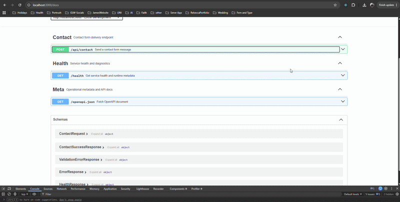

# portfolio-contact-api

[](https://github.com/rebeccadrennan/portfolio-contact-api/actions/workflows/ci.yml)
[](LICENSE)

A production-ready **Node.js + Express** backend service that powers the contact form on my React portfolio. It validates incoming form data, rate-limits submissions, and delivers messages via Resend over HTTPS to my Porkbun-hosted domain inbox — all without exposing credentials to the client.

## Demo



---

## Table of Contents

- [Features](#features)
- [Tech Stack](#tech-stack)
- [API Documentation](#api-documentation)
- [Operational Endpoints](#operational-endpoints)
- [Environment Variables](#environment-variables)
- [Local Development](#local-development)
- [Configuring Resend](#configuring-resend)
- [React Integration](#react-integration)
- [Running Tests](#running-tests)
- [Deployment](#deployment)
- [Security Notes](#security-notes)
- [Future Improvements](#future-improvements)

---

## Features

- **POST /api/contact** — receives and delivers contact form submissions
- **Interactive API docs** at `GET /docs` powered by Swagger UI
- **OpenAPI 3.1 spec** at `GET /openapi.json`
- **Input validation** with [Zod](https://zod.dev/) — required fields, length limits, email format, HTML/script injection rejection
- **Rate limiting** — 5 requests per IP per 15 minutes on the contact endpoint
- **Security headers** via [Helmet](https://helmetjs.github.io/)
- **CORS** restricted to your frontend origin
- **10 kb JSON body limit** to prevent abuse
- **Centralised error handling** — no stack traces leaked in production
- **Request correlation IDs** (`x-request-id`) on every response for easier debugging and support
- **Resend Email API** over HTTPS for reliable hosted delivery to a Porkbun domain mailbox
- **Comprehensive test suite** — Jest + Supertest with mocked email service
- **GitHub Actions CI** — runs lint and tests on every push and pull request
- **Clean architecture** — config / routes / controllers / services / middleware / validators

---

## Tech Stack

| Layer | Technology |
|---|---|
| Runtime | Node.js ≥ 18 |
| Framework | Express 4 |
| Email | Resend API (HTTPS) + Porkbun domain inbox |
| Validation | Zod |
| Security | Helmet, CORS, express-rate-limit |
| Logging | Morgan |
| Compression | compression |
| Testing | Jest + Supertest |
| Linting | ESLint (flat config) + Prettier |
| CI | GitHub Actions |

---

## API Documentation

### `POST /api/contact`

Sends a contact form message to the configured inbox.

**Request body** (`application/json`):

```json
{
  "name": "Rebecca Drennan",
  "email": "person@example.com",
  "subject": "Job opportunity",
  "message": "Hello Rebecca, I'd love to chat..."
}
```

| Field | Rules |
|---|---|
| `name` | Required · max 100 chars · no HTML/scripts |
| `email` | Required · valid email · max 200 chars |
| `subject` | Required · max 150 chars · no HTML/scripts |
| `message` | Required · min 10 chars · max 2000 chars · no HTML/scripts |

All string inputs are trimmed automatically.

**Success response** (`200 OK`):

```json
{
  "success": true,
  "message": "Message sent successfully."
}
```

**Validation error** (`422 Unprocessable Entity`):

```json
{
  "success": false,
  "message": "Please check the form fields.",
  "errors": [
    { "field": "email", "message": "Please provide a valid email address." }
  ]
}
```

**Server error** (`500 Internal Server Error`):

```json
{
  "success": false,
  "message": "Sorry, something went wrong. Please try again later."
}
```

**Rate limit exceeded** (`429 Too Many Requests`):

```json
{
  "success": false,
  "message": "Too many requests. Please wait a moment before trying again."
}
```

---

## Operational Endpoints

### `GET /`

Returns service metadata and quick links to docs and health endpoints.

### `GET /health`

Returns health and runtime metadata (status, version, environment, uptime, timestamps) for uptime monitors and deployment diagnostics.

### `GET /openapi.json`

Returns the OpenAPI 3.1 document for this API.

### `GET /docs`

Serves interactive Swagger UI documentation using the local OpenAPI document.

---

## Environment Variables

Copy `.env.example` to `.env` and fill in your values.  
**Never commit `.env`** — it is listed in `.gitignore`.

```bash
cp .env.example .env
```

| Variable | Description |
|---|---|
| `PORT` | Optional. Port the server listens on. Defaults to `3000` locally and is usually provided by your host in production |
| `NODE_ENV` | `development` \| `production` \| `test` |
| `FRONTEND_URL` | Your React app's origin (used for CORS) |
| `RESEND_API_KEY` | Resend API key used to send contact emails over HTTPS |
| `RESEND_FROM` | Optional from address shown in outgoing emails (default: `Portfolio Contact <onboarding@resend.dev>`) |
| `CONTACT_TO_EMAIL` | The Porkbun domain inbox that receives submissions |

---

## Local Development

```bash
# 1. Clone
git clone https://github.com/rebeccadrennan/portfolio-contact-api.git
cd portfolio-contact-api

# 2. Install dependencies
npm install

# 3. Configure environment
cp .env.example .env
# Edit .env with your values

# 4. Start with hot-reload
npm run dev
```

The server starts on the configured `PORT`.

---

## Configuring Resend

Use Resend to deliver contact emails over HTTPS (port 443), which is typically more reliable on hosted platforms.

1. Create a Resend account and generate an API key.
2. Add `RESEND_API_KEY` to your environment variables.
3. Set `CONTACT_TO_EMAIL` to your Porkbun domain inbox address.
4. Optionally set `RESEND_FROM`.

> ⚠️ Treat API keys like secrets. Store them only in environment variables, never in source code.

---

## React Integration

Set the API URL in your React app's environment:

```
# .env (Vite)
VITE_CONTACT_API_URL=https://your-deployed-api.onrender.com
```

Then call the endpoint:

```js
async function sendContactForm(formData) {
  const response = await fetch(`${import.meta.env.VITE_CONTACT_API_URL}/api/contact`, {
    method: 'POST',
    headers: { 'Content-Type': 'application/json' },
    body: JSON.stringify(formData),
  });

  const data = await response.json();

  if (!response.ok) {
    throw new Error(data.message || 'Failed to send message');
  }

  return data;
}
```

**Handling loading / success / error states in a React component:**

```jsx
function ContactForm() {
  const [status, setStatus] = React.useState('idle'); // idle | loading | success | error
  const [errorMessage, setErrorMessage] = React.useState('');

  const handleSubmit = async (e) => {
    e.preventDefault();
    setStatus('loading');
    try {
      await sendContactForm({ name, email, subject, message });
      setStatus('success');
    } catch (err) {
      setErrorMessage(err.message);
      setStatus('error');
    }
  };

  if (status === 'success') return <p>Thanks! Your message was sent.</p>;

  return (
    <form onSubmit={handleSubmit}>
      {/* form fields */}
      <button disabled={status === 'loading'}>
        {status === 'loading' ? 'Sending…' : 'Send'}
      </button>
      {status === 'error' && <p role="alert">{errorMessage}</p>}
    </form>
  );
}
```

> 🔒 Email provider secrets live **only on the server**. The React app never sees them.

---

## Running Tests

```bash
# Run all tests
npm test

# Run tests with coverage output
npm run test:coverage

# Lint
npm run lint

# Auto-fix lint issues
npm run lint:fix

# Format with Prettier
npm run format

# Run lint + test together (great for pre-push)
npm run check
```

Tests use **Jest + Supertest** and mock the email service so no real email API calls are made.  
Coverage includes: successful submission, missing fields, invalid email, short message, HTML injection rejection, email service failure, health check, and 404.

---

## Deployment

The API is a standard Node.js process — it deploys to any platform that runs Node ≥ 18.

### Render

1. New Web Service → connect your repo.
2. Build command: `npm install`
3. Start command: `npm start`
4. Add all environment variables in the **Environment** tab.

### Railway

1. New Project → deploy from GitHub.
2. Set environment variables in **Variables**.
3. Railway auto-detects the `npm start` script.

### Fly.io

```bash
fly launch
fly secrets set RESEND_API_KEY=... CONTACT_TO_EMAIL=... FRONTEND_URL=...
fly deploy
```

> Set `FRONTEND_URL` to your deployed React app's URL so CORS allows the correct origin.

---

## Security Notes

| Concern | Mitigation |
|---|---|
| **Credential exposure** | App Password stored in env vars only; `.env` is git-ignored |
| **Injection attacks** | Zod rejects HTML tags and `javascript:` URLs in all text fields |
| **Brute-force / spam** | Rate-limited to 5 requests / 15 min per IP |
| **Oversized payloads** | JSON body capped at 10 kb |
| **HTTP header attacks** | Helmet sets secure response headers |
| **CORS abuse** | Only the configured `FRONTEND_URL` origin is allowed |
| **Stack trace leakage** | Error handler returns generic messages in production |
| **Credential logging** | Morgan and app logs never include API secrets |

---

## Future Improvements

- [ ] Add honeypot field to deter automated bots
- [ ] Store submissions in a database (PostgreSQL / MongoDB) for audit trail
- [ ] Send a confirmation email back to the sender
- [ ] Add Turnstile / reCAPTCHA v3 for bot protection
- [ ] Slack / Discord webhook notification as an alternative delivery channel
- [ ] Docker / docker-compose setup for local development

---

## License

[MIT](LICENSE) © Rebecca Drennan
